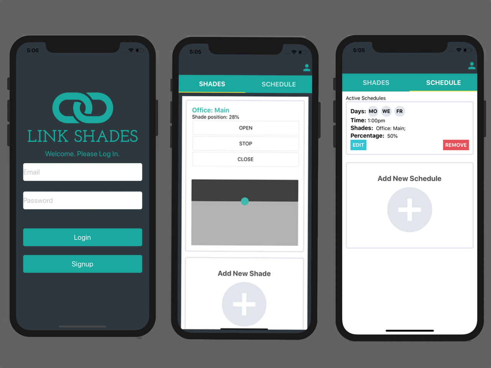

## Link Shades App

* Due to this being a production app, I have posted snippets of the code to a public repository.

I built the The Link Shades App for an exisiting business.  The Link Shades app controls Smart Wifi Connected Window Shades with their Smart Phones.  Users are able to move their Window Shade up and Down in real time and create a daily schedule for their Shade.  Websockets allow a user to see the exact position of their Shade at all time.  The login process includes Authentication, as well as each user command.

